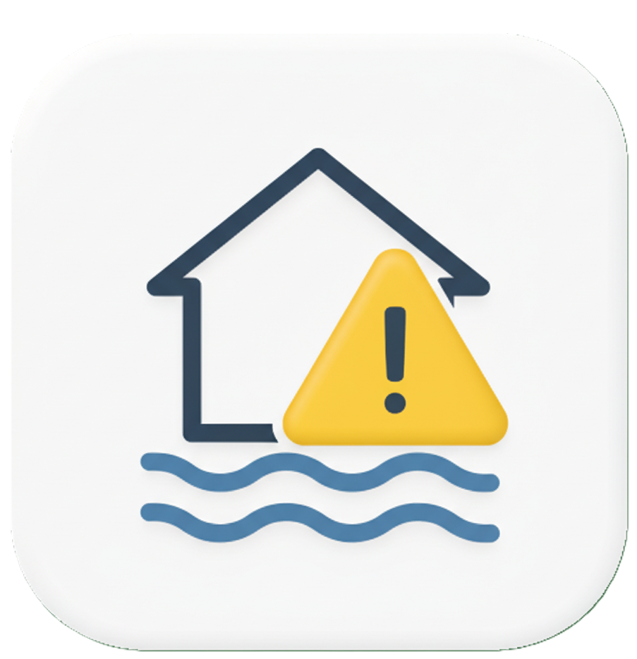
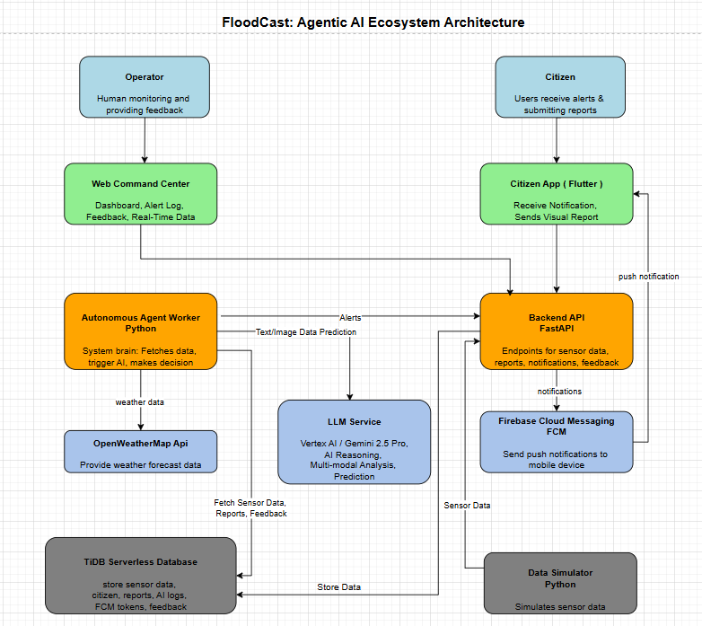

# agen-lingkungan-hackathon<div align="center">
  
  <h1>FloodCast</h1>
  <p><strong>An Agentic AI for Predictive Flood Mitigation</strong></p>
  <p><i>Predicting the future to protect today.</i></p>

  <p>
    
    
    
  </p>
</div>

---

**FloodCast** is an autonomous, multi-modal, and self-correcting ecosystem designed for proactive flood mitigation, built for the TiDB AgentX Hackathon 2025. At its core is an AI agent that works 24/7 to predict flood risks before they happen, learning from human feedback to improve its wisdom over time.

### **[Watch the Demo Video](YOUTUBE_LINK_HERE)**

*(Link to be added upon video completion)*

---

## Table of Contents
- [agen-lingkungan-hackathon](#agen-lingkungan-hackathon)
    - [**Watch the Demo Video**](#watch-the-demo-video)
  - [Table of Contents](#table-of-contents)
  - [The Problem](#the-problem)
  - [Our Solution: The Agentic Approach](#our-solution-the-agentic-approach)
  - [Key Features](#key-features)
  - [The Agentic Workflow](#the-agentic-workflow)
  - [System Architecture](#system-architecture)
  - [Tech Stack](#tech-stack)
  - [Getting Started](#getting-started)
    - [Prerequisites](#prerequisites)
    - [1. Backend \& Simulator Setup](#1-backend--simulator-setup)
    - [2. Web Dashboard Setup](#2-web-dashboard-setup)
    - [3. Mobile App (Flutter) Setup](#3-mobile-app-flutter-setup)
  - [Challenges \& Learnings](#challenges--learnings)
  - [Future Roadmap](#future-roadmap)
  - [Database Schema](#database-schema)
      - [`sensors`](#sensors)
    - [`sensor_readings`](#sensor_readings)
    - [`reports`](#reports)
    - [`alerts`](#alerts)
    - [`fcm_tokens`](#fcm_tokens)

---

## The Problem

Traditional early warning systems are reactive. They issue alerts only after critical water levels have been reached, leaving communities with a dangerously short window to prepare and evacuate. For a country like Indonesia, where seasonal floods are a recurring threat, this reactive approach is no longer sufficient. We need to move from reaction to anticipation.

## Our Solution: The Agentic Approach

Inspired by the hackathon's theme, "Forge Agentic AI for Real-World Impact," we built FloodCast. It's not just a data dashboard; it's a proactive ecosystem centered around an autonomous AI agent that thinks, sees, acts, and learns.

FloodCast provides two distinct interfaces for a complete, collaborative human-AI workflow:
* **The Command Center:** A professional web dashboard for operators to monitor the AI's decisions, analyze data, and provide crucial feedback.
* **The Citizen App:** A public-facing Flutter application that delivers predictive alerts directly to citizens and empowers them to become part of the solution by submitting visual reports from the ground.

## Key Features

* **Autonomous Prediction:** The agent continuously analyzes time-series sensor data from TiDB and external weather forecasts to predict if a dangerous threshold *will be* crossed in the near future.
* **Multi-modal Analysis:** The agent fuses quantitative sensor data with qualitative visual reports (images) submitted by citizens. This allows it to make more accurate, context-aware predictions.
* **Self-Correction Loop:** Our most advanced feature. The agent learns from feedback provided by human operators ("Valid Alert" or "False Alarm") via the dashboard. It uses this history to make smarter, more nuanced decisions in the future (In-Context Learning).
* **Human-in-the-Loop:** Operators are not replaced; they are empowered. The dashboard allows for manual overrides and direct intervention, creating a true human-AI collaborative system.

## The Agentic Workflow

The core of FloodCast is a multi-step, automated workflow performed by our agent every cycle:

1.  **Perceive:** The agent queries the **TiDB** database to fetch the latest sensor data, recent citizen reports (images), and past alert feedback.
2.  **Enrich:** It calls the OpenWeatherMap API to get external context (weather forecasts).
3.  **Reason:** It sends this fused, multi-modal data to the Gemini 2.5 Pro model via Vertex AI, using a sophisticated prompt that instructs the AI to perform a chain-of-thought analysis and learn from past examples.
4.  **Decide:** It parses the structured JSON response from the AI to determine if a threat is predicted.
5.  **Act:** If a threat is detected, it autonomously:
    * Triggers a push notification to all registered devices via FCM.
    * Logs its decision, reasoning, and confidence score back into the **TiDB** `alerts` table for auditing and future learning.

## System Architecture

Our system is built with a modern, modular, service-oriented architecture designed for scalability and maintainability.




## Tech Stack

* **Backend:** Python, FastAPI, SQLAlchemy
* **Database:** **TiDB Serverless**
* **AI Core:** Google Cloud Vertex AI (Gemini 2.5 Pro)
* **Web Dashboard:** SvelteKit, JavaScript, Chart.js
* **Mobile App:** Flutter, Dart, BLoC
* **Cloud & DevOps:** Google Cloud Run, Firebase (FCM), Git/GitHub
* **External APIs:** OpenWeatherMap API

## Getting Started

### Prerequisites
* Python 3.11+, Node.js & npm, Flutter SDK, Git

### 1. Backend & Simulator Setup
```bash
# From the project root, navigate to the backend
cd backend

# Create and activate a virtual environment
# On Windows:
python -m venv .venv
.\.venv\Scripts\activate

# Install dependencies
pip install -r requirements.txt

# Create a .env file from the example
# Create a file named .env and fill in your credentials based on .env.example
# Set GOOGLE_APPLICATION_CREDENTIALS to the path of your service account key

# Run the API Server (Terminal 1) from the PROJECT ROOT
uvicorn main:app --reload

# Run the Agent Worker (Terminal 2) from the PROJECT ROOT
python -m run_agent

# Run the Simulator (Terminal 3) from the PROJECT ROOT
python simulator/simulator.py --scenario rising
```

### 2. Web Dashboard Setup

```bash
# From the project root, navigate to the web dashboard
cd dashboard-web

# Install dependencies
npm install

# Run the development server
npm run dev
```

### 3. Mobile App (Flutter) Setup

1. Navigate to the tidbclient directory.

1. Follow the Firebase setup guide to create a project and place your google-services.json file in android/app/.

2. Run flutter pub get to install dependencies.

3. Run the app
## Challenges & Learnings
Our biggest challenge was a classic full-stack BIGINT precision issue, where large IDs from TiDB were being rounded by JavaScript. We solved this by treating IDs as strings end-to-end, a robust solution born from experience. This project was a masterclass in building a truly "agentic" system. We learned that an agent's intelligence isn't just its model, but the ecosystem of data and feedback it lives in. Implementing the self-correction loop via in-context learning was a powerful demonstration of combining machine prediction with human wisdom.

## Future Roadmap
This hackathon project is a robust foundation. We envision FloodCast evolving into a comprehensive environmental resilience platform with the following roadmap:

* **Hyper-Local Causal Analysis:** Integrating more diverse data points beyond rainfall and sensor levels, such as waste management reports and drainage blockage data from citizen reports, to understand and predict the root causes of flooding in specific micro-locations.

* **Crisis Communication & Resource Hub:** Evolving the Flutter app into a critical public utility. During a crisis, it will provide real-time disaster progression updates, safe evacuation routes calculated by the agent, and a map of critical resources like public kitchens, shelters, and medical posts.

* **Proactive Public Education:** Adding an educational module to the app that provides actionable information on flood prevention, such as tutorials on proper waste disposal, community preparedness checklists, and contact information for local authorities.

* **Advanced Root Cause Analysis with Vector Search:** Utilizing TiDB's Vector Search to find historical events with similar multi-modal patterns (sensor data + images). This will provide officials on the dashboard with deeper, data-driven insights into why a specific prediction was made by comparing it to past incidents.

##  Database Schema

FloodCast relies on a structured schema within TiDB Serverless to manage its data flow, from sensor ingestion to AI decision logging.

Below are the SQL `CREATE TABLE` statements for our primary tables:
#### `sensors`
Stores static information about each IoT sensor.
```sql
CREATE TABLE sensors (
    id VARCHAR(50) PRIMARY KEY,
    name VARCHAR(255) NOT NULL,
    location_name VARCHAR(255),
    latitude DECIMAL(10, 8) NOT NULL,
    longitude DECIMAL(11, 8) NOT NULL,
    sensor_type VARCHAR(50) NOT NULL,
    created_at TIMESTAMP DEFAULT CURRENT_TIMESTAMP
);
```

### `sensor_readings`
The main time-series table for ingesting all raw sensor data.

```sql
CREATE TABLE sensor_readings (
    id BIGINT PRIMARY KEY AUTO_RANDOM,
    sensor_id VARCHAR(50) NOT NULL,
    reading_value DECIMAL(10, 2) NOT NULL,
    reading_unit VARCHAR(20),
    timestamp TIMESTAMP(3) NOT NULL,
    CONSTRAINT fk_sensor_id FOREIGN KEY (sensor_id) REFERENCES sensors(id)
);
```

### `reports`
Stores metadata for visual reports submitted by citizens via the Flutter app.

```sql
CREATE TABLE reports (
    id BIGINT PRIMARY KEY AUTO_RANDOM,
    image_url VARCHAR(1024) NOT NULL,
    notes TEXT,
    latitude DECIMAL(10, 8),
    longitude DECIMAL(11, 8),
    status VARCHAR(50) DEFAULT 'pending_analysis',
    created_at TIMESTAMP(3) DEFAULT CURRENT_TIMESTAMP(3)
);
```

### `alerts`
Acts as an audit log for every predictive alert generated by the AI agent, including the operator's feedback for the self-correction loop.

```sql
CREATE TABLE alerts (
    id BIGINT PRIMARY KEY AUTO_RANDOM,
    sensor_id VARCHAR(50) NOT NULL,
    alert_level INT NOT NULL,
    message TEXT,
    confidence_score DECIMAL(5, 4) NULL,
    feedback VARCHAR(50) NULL DEFAULT NULL,
    generated_at TIMESTAMP(3) NOT NULL,
    CONSTRAINT fk_alert_sensor_id FOREIGN KEY (sensor_id) REFERENCES sensors(id)
);
```

### `fcm_tokens`
Stores the unique device tokens for sending push notifications via Firebase Cloud Messaging.

```sql
CREATE TABLE fcm_tokens (
    token VARCHAR(255) PRIMARY KEY,
    created_at TIMESTAMP(3) DEFAULT CURRENT_TIMESTAMP(3),
    updated_at TIMESTAMP(3) DEFAULT CURRENT_TIMESTAMP(3) ON UPDATE CURRENT_TIMESTAMP(3)
);
```